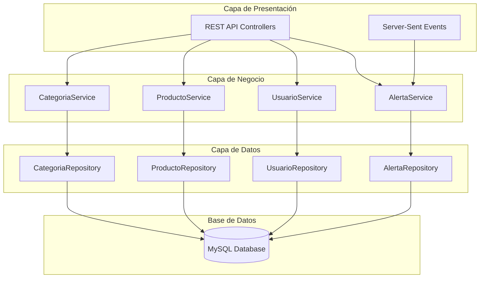

## **Maestranza Unidos**
**Sistema integral de gestión de inventario con alertas en tiempo real y control de usuarios**


## 📋 Descripción

- **El Sistema de Gestión de Inventario Maestranza es una aplicación backend desarrollada en Spring Boot que proporciona una solución completa para la gestión de inventarios industriales. El sistema incluye gestión de productos, categorías, alertas automáticas de stock, notificaciones en tiempo real y un sistema robusto de autenticación y autorización.**

## ✨ Características Principales

### 🔐 Sistema de Autenticación y Autorización
- **Autenticación JWT** con tokens seguros
- **Sistema de roles granular** con 7 niveles de acceso
- **Blacklist de tokens** para logout seguro
- **Encriptación BCrypt** para contraseñas

### 📦 Gestión de Inventario
- **CRUD completo** de productos y categorías
- **Control de stock** con umbrales configurables
- **Historial de precios** con seguimiento temporal
- **Gestión de ubicaciones** y códigos únicos

### 🚨 Sistema de Alertas Inteligente
- **Alertas automáticas** de stock bajo/crítico
- **Notificaciones en tiempo real** vía Server-Sent Events (SSE)
- **Clasificación por urgencia** (Baja, Media, Alta, Crítica)
- **Gestión de estados** (Activa/Inactiva)

### 📊 Dashboard y Reportes
- **Estadísticas en tiempo real** de alertas
- **Contadores de inventario** por categoría
- **Resúmenes ejecutivos** para dashboard
- **Consultas avanzadas** por fecha y producto


## 🏗️ Arquitectura del Sistema




## 🚀 Tecnologías Utilizadas
<div align="center">


</div>

### Backend Framework
- **Spring Boot 3.5.0** - Framework principal
- **Spring Security** - Autenticación y autorización
- **Spring Data JPA** - Persistencia de datos
- **Spring Web** - API REST

### Base de Datos
- **MySQL 8.0** - Base de datos principal
- **Hibernate** - ORM con dialecto MySQL8

### Seguridad
- **JWT (JSON Web Tokens)** - Autenticación stateless
- **BCrypt** - Encriptación de contraseñas
- **CORS** - Configuración cross-origin

### Herramientas de Desarrollo
- **Maven** - Gestión de dependencias
- **Lombok** - Reducción de código boilerplate
- **SLF4J** - Sistema de logging

## 📡 API Endpoints

### 🔐 Autenticación (`/api/auth`)
```http
POST /api/auth/login          # Iniciar sesión
POST /api/auth/registro       # Registrar usuario
GET  /api/auth/verify         # Verificar token
POST /api/auth/logout         # Cerrar sesión
```

### 👥 Gestión de Usuarios (`/api/v1/usuarios`)
```http
GET    /api/v1/usuarios           # Listar usuarios
GET    /api/v1/usuarios/{id}      # Obtener usuario
POST   /api/v1/usuarios           # Crear usuario
PATCH  /api/v1/usuarios/{id}      # Actualizar usuario
DELETE /api/v1/usuarios/{id}      # Eliminar usuario
```

### 🚨 Gestión de Alertas (`/api/v1/alertas`)
```http
GET   /api/v1/alertas                    # Todas las alertas
GET   /api/v1/alertas/activas           # Alertas activas
GET   /api/v1/alertas/count             # Contador de alertas
GET   /api/v1/alertas/subscribe         # Suscripción SSE
PATCH /api/v1/alertas/resolver/{id}     # Resolver alerta
```

### 📦 Gestión de Productos (`/api/v1/productos`)
```http
GET    /api/v1/productos         # Listar productos
POST   /api/v1/productos         # Crear producto
PUT    /api/v1/productos/{id}    # Actualizar producto
DELETE /api/v1/productos/{id}    # Eliminar producto
```

## 🔧 Configuración e Instalación

### Prerrequisitos
- **Java 17** o superior
- **Maven 3.6+**
- **MySQL 8.0**
- **Git**

### 1. Clonar el Repositorio
```bash
git clone https://github.com/Gutierrez-Urrutia/maestranza-backend.git
cd maestranza-backend
```

### 2. Configurar Base de Datos

## Producción
```properties
# application-prod.properties
spring.datasource.url=*****
spring.datasource.username=****
spring.datasource.password=****
```

## Desarrollo
```properties
# application-dev.properties
spring.datasource.url=*****
spring.datasource.username=****
spring.datasource.password=****
```

- **Solicitar estos valores al desarrollador

### 3. Compilar y Ejecutar

#### Desarrollo
```bash
mvn clean install
mvn spring-boot:run -Dspring-boot.run.profiles=dev
```

#### Producción
```bash
mvn clean package
java -jar target/Main-0.0.1-SNAPSHOT.jar --spring.profiles.active=prod
```

- **La aplicación estará disponible en `http://localhost:8090`

## 👤 Sistema de Roles

| Rol | Descripción | Permisos |
|-----|-------------|----------|
| `ROLE_ADMINISTRADOR` | Administrador del sistema | Acceso completo |
| `ROLE_INVENTARIO` | Gestión de inventario | CRUD productos, alertas |
| `ROLE_COMPRAS` | Departamento de compras | Consulta productos, alertas |
| `ROLE_LOGISTICA` | Gestión logística | Ubicaciones, movimientos |
| `ROLE_PRODUCCION` | Área de producción | Consulta stock, alertas |
| `ROLE_AUDITOR` | Auditoría interna | Solo lectura |
| `ROLE_GERENCIA` | Gerencia general | Reportes, estadísticas |

## 🔄 Características en Tiempo Real

### Server-Sent Events (SSE)
El sistema implementa notificaciones en tiempo real usando SSE:

```javascript
// Ejemplo de conexión desde frontend
const eventSource = new EventSource('/api/v1/alertas/subscribe');

eventSource.onmessage = function(event) {
    const alerta = JSON.parse(event.data);
    console.log('Nueva alerta:', alerta);
};
```

### Procesamiento Automático
- **Verificación cada 10 segundos** de nuevas alertas
- **Distribución automática** a clientes conectados
- **Limpieza automática** de conexiones inactivas

## 📊 Modelo de Datos

### Entidades Principales

#### Producto
- `id`, `codigo`, `nombre`, `descripcion`
- `stock`, `umbralStock`, `ubicacion`
- `fechaIngreso`, `activo`
- Relaciones: `Categoria`, `HistorialPrecios`, `Alertas`

#### Alerta
- `id`, `nombre`, `descripcion`, `fecha`
- `activo`, `nivelUrgencia`
- Relación: `Producto`

#### Usuario
- `id`, `username`, `password`, `email`
- `nombre`, `apellido`, `activo`
- Relación: `Roles`

## 🛡️ Seguridad

### Configuración JWT
```properties
app.jwt.secret=*****
app.jwt.expiration=86400000  # 24 horas
```

- **La duración del token se usa de esta manera para fines de desarrollo, sin embargo, los tiempos de validez deberían ser menores.

### Endpoints Públicos
- `/api/auth/**` - Autenticación
- `/api/v1/alertas/subscribe` - SSE
- `/api/v1/alertas/count` - Contador público

## 📝 Logging y Monitoreo

### Configuración de Logs
```properties
logging.level.org.springframework=INFO
logging.level.cl.duoc.maestranza.Maestranza.security=INFO
```

### Métricas Disponibles
- Conexiones SSE activas
- Alertas generadas por período
- Usuarios activos
- Operaciones por endpoint

## 🚀 Despliegue

### Variables de Entorno
```bash
SPRING_PROFILES_ACTIVE=prod
SPRING_DATASOURCE_URL=jdbc:mysql://host:port/database
SPRING_DATASOURCE_USERNAME=username
SPRING_DATASOURCE_PASSWORD=password
JWT_SECRET=your-secret-key
```

### Docker (Opcional)
```dockerfile
FROM openjdk:17-jdk-slim
COPY target/Main-0.0.1-SNAPSHOT.jar app.jar
EXPOSE 8090
ENTRYPOINT ["java", "-jar", "/app.jar"]
```

## 📄 Licencia

Este proyecto está bajo la Licencia MIT. Ver el archivo `LICENSE` para más detalles.

## 📞 Soporte

Para soporte técnico o consultas:
- **Email**: pa.gutierrezu@duocuc.cl
- **Issues**: [GitHub Issues](https://github.com/Gutierrez-Urrutia/maestranza-backend/issues)

